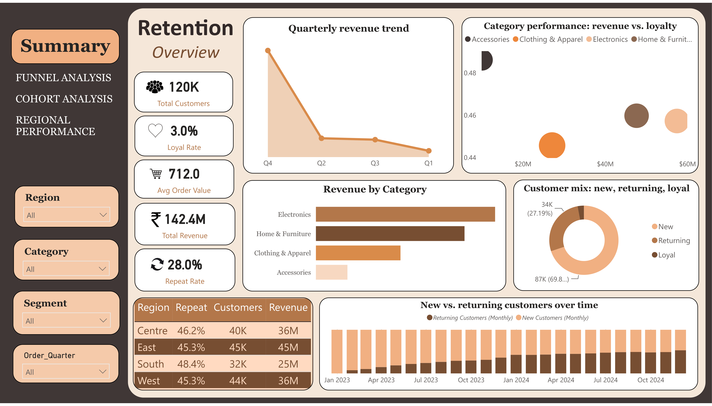

# Customer Retention & Conversion Dashboard

A Power BI dashboard analyzing customer conversion funnel stages and monthly retention cohorts from transactional sales data — built on SQL Server for data prep, DAX for measures, and a custom warm color theme.

---

**Quick links:**

- [📊 Open the Power BI report](./PowerBI/Retention.pbix)
- [🗄️ Phase 1 — database & table setup](./SQL/prdouct_DB_P1.sql)
- [🗄️ Phase 2 — retention cohort query](./SQL/product_DB_P2.sql)
- [📄 Source dataset (CSV)](./database/product_sales_dataset_final.csv)

---

## Overview

This project tracks two connected questions about customer behavior:
1. **Conversion** — how many customers move from a first purchase to becoming returning, repeat, and loyal buyers?
2. **Retention** — of the customers who came back, how long do they actually stick around, cohort by cohort?
The dashboard's Summary page ties both together alongside revenue, category, and regional breakdowns.

## Pages

- **Summary** — KPI overview, quarterly revenue trend, revenue by category, category performance (revenue vs. loyalty) scatter, customer mix donut (new/returning/loyal), new-vs-returning customers over time, and a region performance table.
- **Funnel Analysis** — conversion funnel from all customers through returning (2+ orders), repeat (3+ orders), to loyal (6+ orders).
- **Cohort Analysis** — month-over-month retention heatmap matrix by cohort start month, sliceable by region.
- **Regional Performance** — revenue, customer count, and repeat rate broken down by region.

## Data pipeline

1. **`SQL/prdouct_DB_P1.sql`** creates `product_sales_db` and the `product_sales_dataset_final` table, then bulk-loads it from the CSV.
2. **`SQL/product_DB_P2.sql`** computes the retention cohort matrix — first purchase month per customer, cohort sizes, and month-over-month retention rate, sliceable by region.
3. Both the raw table and the cohort query output are loaded into Power BI as separate tables (no relationship between them — they answer different questions and don't share a clean join key).

## Tech stack

- **SQL Server** — data loading and cohort retention calculation
- **Power BI Desktop** — data modeling (DAX), visuals, custom theme
- **DAX** — customer order count, funnel stage segmentation, repeat/loyal rate, time-based retention measures

## How to open

1. Clone this repo.
2. Run `SQL/prdouct_DB_P1.sql` against a SQL Server instance to create and load the base table (update the `BULK INSERT` file path to point at your local copy of `database/product_sales_dataset_final.csv`).
3. Run `SQL/product_DB_P2.sql` to generate the cohort retention output.
4. Open `PowerBI/Retention.pbix` in Power BI Desktop and point the data source connections at your SQL Server instance.

## Author's note

This started as a way to practice going end-to-end — raw CSV → SQL Server → DAX → a dashboard that actually tells a story instead of just showing numbers. The cohort retention logic and the funnel segmentation were the two pieces I spent the most time getting right, since they needed to hold up as real customer-behavior math, not just chart decoration.
Feedback, issues, and PRs are welcome — feel free to open an issue if something in the SQL or DAX doesn't behave the way you'd expect on your own data.

— Priyam Simalti

